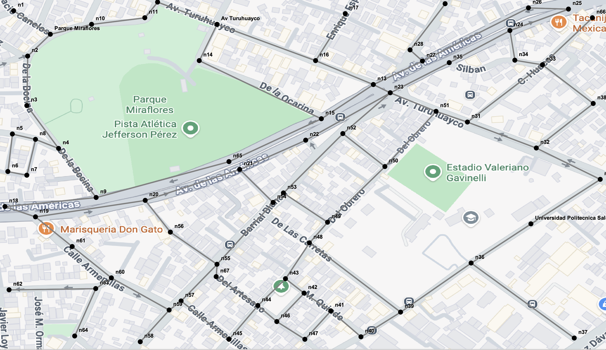
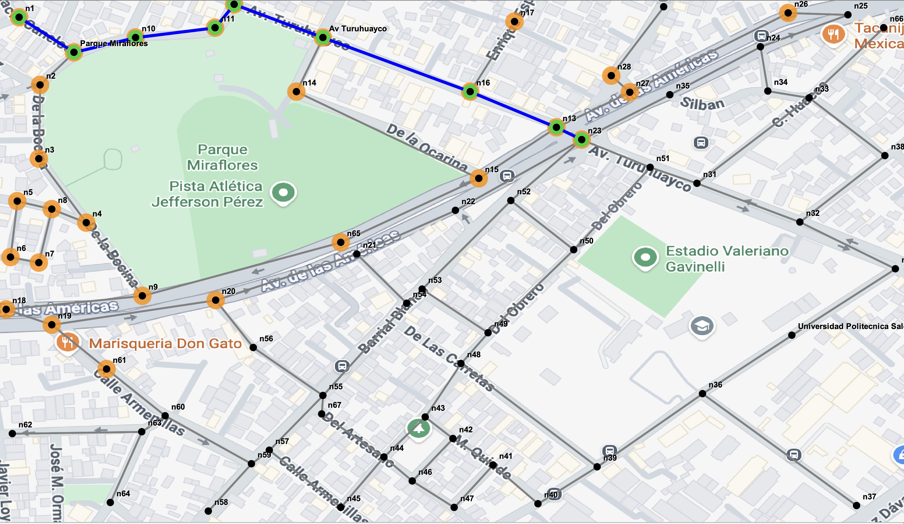
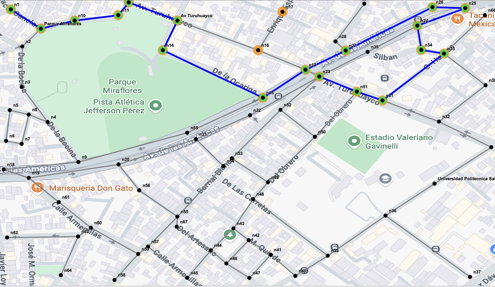
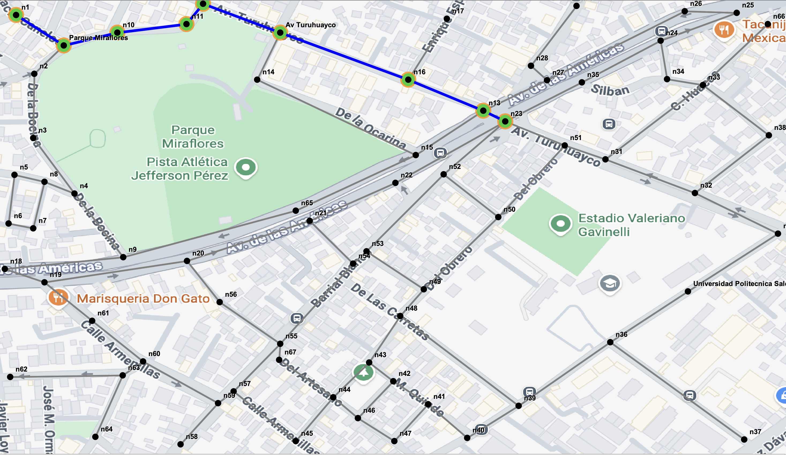
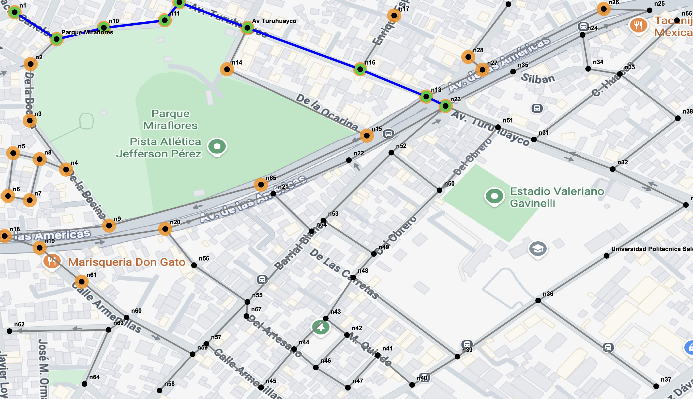

# Sistema de Búsqueda con Grafos

---

* **Institución:** Universidad Politécnica Salesiana
* **Carrera:** Ingeniería en Computación
* **Asignatura:** Estructura de Datos
* **Integrantes:** 
  * Bryam Carchi (bcarchim@est.ups.edu.ec)
  * Xavier Aucay (xaucay@est.ups.edu.ec)
  * Juan Coronel (jcoronelp1@est.ups.edu.ec)
  * Andrea Sagbay (asagbayd1@est.ups.edu.ec)
 
* **Fecha:** 28 Julio, 2026


---

## Índice
1. Objetivo
2. Descripción del Problema
3. Marco Teórico
   * 3.1. Teoría de Grafos en Entornos Urbanos
   * 3.2. Búsqueda en Anchura (BFS - Breadth-First Search)
   * 3.3. Búsqueda en Profundidad (DFS - Depth-First Search)
   * 3.4. Algoritmo de Dijkstra
   * 3.5. Algoritmo A* (A-Estrella)
4. Tecnologías Utilizadas
5. Diagrama UML y Explicación
6. Arquitectura y Estructura de Carpetas
7. Explicación General del Funcionamiento
8. Capturas de Configuraciones de Mapas
9. Ejemplo Comentado y Explicado de un Algoritmo
10. Tabla Comparativa de Resultados
11. Conclusión Individual por Integrante
12. Recomendaciones y Posibles Aplicaciones Futuras

---

## 1. Objetivo
Desarrollar una aplicación funcional utilizando Java Swing y estructuras de datos de grafos para asi hacer un modelo de un mapa real, implementando y comparando algoritmos de búsqueda y rutas óptimas (BFS, DFS, Dijkstra y A*).

## 2. Descripción del Problema
En la gestión de movilidad y navegación moderna encontrar rutas mas eficientes entre esquinas o puntos de interés (como parques y universidades) es un desafío computacional para resolver una necesidad de la vida cotidiana. El proyecto lo resuelve con la representación de un mapa mediante un grafo no dirigido ponderado (con multiples nodos y múltiples conexiones bidireccionales), permitiendo calcular tanto recorridos de exploración como rutas de costo mínimo y distancia euclidiana óptima.

## 3. Marco Teórico

### 3.1. Teoría de Grafos en Entornos Urbanos
Un grafo $G = (V, E)$ es una estructura matemática abstracta que permite modelar redes del mundo real, donde el conjunto $V$ representa los vértices (en este contexto, esquinas, intersecciones, parques o puntos de interés con coordenadas $X, Y$) y el conjunto $E$ representa las aristas (las calles o avenidas que conectan dichos puntos). En nuestra aplicación, el grafo está implementado de forma genérica (`Graph<T>`) utilizando una tabla de adyacencia basada en `LinkedHashMap`, lo que garantiza un acceso rápido y ordenado a los vecinos de cada nodo. Las conexiones se manejan con conexiones bidireccionales mediante el método `addEdge`, permitiendo el recorrido en ambos sentidos.

### 3.2. Búsqueda en Anchura (BFS - Breadth-First Search)
El algoritmo **BFS** es un método de recorrido o búsqueda no informada ("ciega") que explora el grafo por niveles de proximidad. 
* **Funcionamiento:** Utiliza una estructura de datos tipo Cola (*Queue*, FIFO - *First In, First Out*). Comienza en un nodo raíz, visita todos sus vecinos directos antes de pasar al siguiente nivel de profundidad.
* **Propiedades:** Garantiza encontrar el camino con la **menor cantidad de saltos o aristas** entre el origen y el destino, siempre y cuando el grafo no esté ponderado. 
* **Complejidad:** Su complejidad temporal es de $O(V + E)$ en el peor de los casos, donde $V$ es el número de vértices y $E$ el número de aristas.

### 3.3. Búsqueda en Profundidad (DFS - Depth-First Search)
El algoritmo **DFS** es un método de recorrido sistemático que prioriza la exploración en profundidad a lo largo de cada rama antes de realizar un retroceso (*backtracking*).
* **Funcionamiento:** Utiliza una estructura de datos tipo Pila (*Stack*, LIFO - *Last In, First Out*), la cual puede implementarse mediante llamadas recursivas o de manera iterativa. El algoritmo avanza visitando un nodo adyacente no visitado hasta que ya no encuentra salidas, momento en el cual retrocede para explorar caminos alternativos.
* **Propiedades:** No garantiza encontrar la ruta más corta, ya que puede adentrarse en ramales muy largos o incorrectos antes de hallar el destino. Sin embargo, es extremadamente eficiente para verificar conectividad, detectar ciclos o realizar recorridos exhaustivos.
* **Complejidad:** Su complejidad temporal es de $O(V + E)$ y espacial de $O(V)$ debido al almacenamiento de la pila de recursión y los nodos visitados.

### 3.4. Algoritmo de Dijkstra
Diseñado por Edsger W. Dijkstra, este es un algoritmo clásico de búsqueda de caminos óptimos en grafos ponderados con costos no negativos.
* **Funcionamiento:** Utiliza una cola de prioridad (*Priority Queue*) para seleccionar de forma codiciosa (*greedy*) el nodo no visitado con la distancia acumulada menor desde el punto de partida. Actualiza iterativamente los costos mínimos de los vecinos adyacentes (*relaxation*).
* **Propiedades:** Garantiza de forma matemática encontrar **la ruta más corta absoluta** basada en los pesos reales de las aristas (en nuestro caso, las distancias físicas calculadas entre coordenadas). Sin embargo, al no tener una dirección predeterminada hacia la meta, tiende a expandirse uniformemente en forma de ondas circulares, explorando zonas innecesarias si el destino está lejos.
* **Complejidad:** Su complejidad temporal utilizando una cola de prioridad binaria es de $O((V + E) \log V)$.

### 3.5. Algoritmo A* (A-Estrella)
El algoritmo **A\*** es una evolución heurística y avanzada de Dijkstra, altamente optimizado para la navegación y la inteligencia artificial en mapas.
* **Funcionamiento:** Evalúa los nodos combinando dos funciones matemáticas mediante la fórmula de costo total: 
  $$f(n) = g(n) + h(n)$$
  * $g(n)$: El costo real acumulado desde el nodo inicial hasta el nodo actual $n$ (igual que en Dijkstra).
  * $h(n)$: Una función heurística estimada que calcula el costo restante desde el nodo actual $n$ hasta el nodo objetivo. En nuestra implementación, se utiliza la **distancia euclidiana en línea recta** entre las coordenadas $(X, Y)$ de ambos puntos.
* **Propiedades:** Es un algoritmo "admisible" (siempre que la heurística nunca sobrestime el costo real). Al incorporar $h(n)$, el algoritmo deja de explorar a ciegas y dirige su atención de manera inteligente hacia la dirección del destino, logrando encontrar la ruta óptima con una velocidad muy superior y evaluando muchos menos nodos que Dijkstra.
* **Complejidad:** Depende en gran medida de la precisión de la heurística, pero en el mejor de los casos reduce drásticamente el espacio de búsqueda en comparación con los algoritmos ciegos o de fuerza bruta.

## 4. Tecnologías Utilizadas
* **Lenguaje:** Java.
* **Interfaz Gráfica:** Java Swing / AWT
* **Estructuras con configuración propia:** `Graph<T>`, `Node<T>`, `LinkedHashMap`, `LinkedHashSet`, Pilas y Colas con propia personalizacion.
* **Persistencia:** Archivos CSV para almacenamiento y carga de configuraciones del mapa.
* **Control de Versiones:** Git y GitHub.

## 5. Diagrama UML y Explicación

* **`Graph<T>`:** Administra la lista de adyacencia mediante un mapa enlazado y las distintas acciones de inserción y eliminación de vértices y aristas.
* **`MapController`:** Actúa como el intermediario (Controlador en MVC) gestionando los requeriminetos del usuario y la ejecución de los algoritmos de búsqueda.
* **`MapPanel`:** Componente visual encargado de mostrar la imagen de fondo del mapa, las aristas y la animación paso a paso de los nodos visitados y la ruta final.
* **`MainFrame`:** Ventana principal que contiene la barra de menú de edición interactiva y los diferentes controles.

## 6. Arquitectura y Estructura de Carpetas
```text
icc-est-mapaConGrafos/
│
├── src/
│   ├── App.java
│   ├── controllers/
│   │   └── MapController.java
│   ├── models/
│   │   ├── MapPoint.java
│   │   └── VisualizationMode.java
│   ├── persistence/
│   │   ├── FileGraphRepository.java
│   │   └── GraphRepository.java
│   ├── structures/
│   │   ├── graphs/
│   │   │   ├── Graph.java
│   │   │   ├── PathFinder.java
│   │   │   ├── PathResult.java
│   │   │   └── implementations/
│   │   │       ├── AStarPathFinder.java
│   │   │       ├── BFSPathFinder.java
│   │   │       ├── DFSPathFinder.java
│   │   │       ├── DijkstraPathFinder.java
│   │   │       └── Heuristic.java
│   │   └── node/
│   │       └── Node.java
│   └── views/
│       ├── MainFrame.java
│       └── MapPanel.java
└── resources/
    └── maps/
        └── map.png
```
---

## 7. Explicación General del Funcionamiento
* Al ejecutar la aplicación en el apartado de App.java, se cargan todos los nodos previamente configurados con sus cordenadas ($X,Y$) y sus aristas bidireccionales correspondientes distribuidas en el mapa.

* El usuario tiene la opccion de elegir el nodo de inicio y el nodo de destino, así como el algoritmo de su preferencia (BFS, DFS, Dijkstra o A*).

* El controlador procesa la solicitud realizada por el usuario en la interfaz y retorna un PathResult con los nodos visitados y el camino óptimo.

* Un temporizador gráfico (Timer) anima de forma visual el proceso de exploración (color naranja) y se encarga de trazar la ruta final óptima (azul y verde).

---

## 8. Capturas de Configuraciones de Mapas
**Mapa con todos los nodos distribuidos**

**Mapa con BFS**

**Mapa con DFS**

**Mapa con AEstrella**

**Mapa con Dijkstra**


---

## 9. Ejemplo Comentado y Explicado de un Algoritmo

Analizaremos la ejecución del algoritmo A* al calcular una ruta desde el Parque Miraflores hasta la Universidad Politécnica Salesiana.
Proceso paso a paso:
* Punto de inicio: El algoritmo toma el nodo inicial (Parque Miraflores) y lo pone en una cola de prioridad.
* Evaluación de Costos $f(n) = g(n) + h(n)$: EL algoritmo calcula:
   * $g(n)$ (Costo real): La distancia total por las aristas recorridas desde el punto de inicio.
   * $h(n)$ (Heurística): La distancia en línea recta (euclidiana) desde las coordenadas $(X, Y)$ del nodo actual el final, usando la fórmula 
   $\sqrt{(x_2 - x_1)^2 + (y_2 - y_1)^2}$.
* Selección Inteligente: A diferencia de los algoritmos ciegos, A* prioriza siempre el nodo con el menor costo total $f(n)$. Gracias a la heurística $h(n)$, el algoritmo ya puede saber dónde está la universidad y asi avanza de forma directa por avenidas principales y evitando dar desvios innecesarios.
* Llegada: Al llegar a el nodo destino, el algoritmo traza el camino óptimo hacia atrás y lo entrega al controlador para  que se muestre la animación final en el mapa.

---

## 10. Tabla Comparativa de Resultados

---

## 11. Conclusión Individual por Integrante
* Bryam Carchi: La realización de estructuras de grafos personalizadas me permitió comprender de mejor manera la diferencia entre recorridos ciegos (BFS/DFS) y algoritmos con mejor optimizacion de rutas (Dijkstra/A*), en donde mediante la ejecucuion se visualizo que el A* nos dio la mejor ruta, esta fue la mas directa y gastando menos recursos.
* Xavier Aucay : Con este proyecto fortalecí mis conocimientos sobre grafos y algoritmos de búsqueda, comprendí cuando conviene utilizar BFS, DFS, Dijkstra o A*. Además, mejoré mis habilidades en Java y entendi la importancia de las estructuras de datos para resolver problemas de rutas de manera mas eficiente

---
## 12. Recomendaciones y Posibles Aplicaciones Futuras

### Recomendaciones TÉCNICAS Y DE MEJORA
## 12. Recomendaciones y Posibles Aplicaciones Futuras

### Recomendaciones
* **Mejorar el rendimiento de los algoritmos:** Para mapas con miles de nodos, convendría implementar colas de prioridad más eficientes (como un *Fibonacci Heap*) y optimizar las listas de adyacencia. Esto reduciría significativamente los tiempos de cómputo en búsquedas masivas.
* **Integrar coordenadas reales (GPS):** Actualmente el mapa trabaja con posiciones fijas en píxeles. Una gran mejora sería migrar a coordenadas de latitud y longitud reales (usando proyecciones como Mercator) para lograr una ubicación geográfica precisa.
* **Optimizar la fluidez de la interfaz:** Es recomendable separar completamente el procesamiento de los algoritmos (AStarPathFinder.java) del renderizado en pantalla (MapPanel.java). 
* **Soportar formatos estándar de mapas:** Sería ideal expandir el módulo de persistencia para que la aplicación pueda importar y exportar grafos en formatos comunes como JSON, GeoJSON o KML, en lugar de depender únicamente de archivos de texto locales.

### Posibles Aplicaciones Futuras
* **Navegación urbana y transporte público:** El algoritmo A* puede adaptarse para calcular rutas considerando el tráfico en tiempo real, el sentido de las calles, semáforos o transbordos de líneas de autobús.
* **Optimización de entregas y logística:** Podría evolucionar para resolver problemas de ruteo de vehículos (VRP) o del viajante (TSP), ayudando a empresas de delivery a calcular la mejor secuencia de entregas.
* **Guía de navegación dentro del campus:** Se puede aplicar para crear un mapa interactivo de interiores que guíe a estudiantes y visitantes a través de los edificios, facultades y aulas de la universidad.
* **Rutas de evacuación y emergencias:** Permite simular situaciones de riesgo deshabilitando calles o nodos bloqueados en tiempo real, trazando instantáneamente la ruta más segura hacia zonas de evacuación (como parques o canchas cercanas).